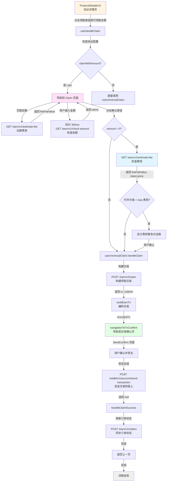
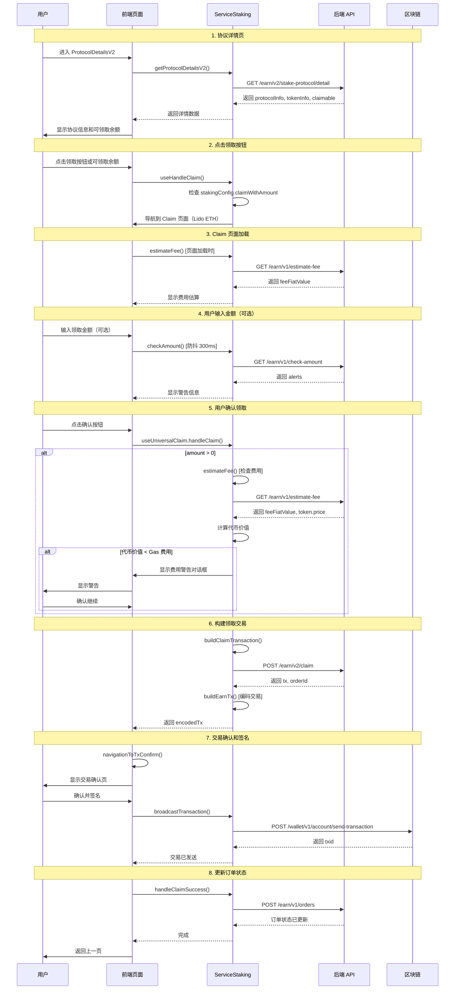
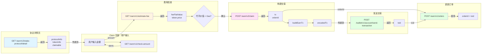

# Lido ETH Claim 完整流程分析

## 概述

本文档详细分析 Lido ETH 领取奖励（Claim）的完整流程，包括页面导航、API 调用和参数来源。

## 流程概览

### 文本流程图

```
ProtocolDetailsV2（协议详情页）
  ↓ 点击"领取"按钮或可领取余额
Claim（领取页面）
  ↓ 输入金额并确认（可选）
  ↓ 检查费用警告（如果代币价值 < Gas 费用）
SendConfirm（交易确认页）
  ↓ 签名并发送
完成
```

### 详细流程图（Mermaid）



### API 调用时序图（Mermaid）



### 数据流转图（Mermaid）



---

## 1. 页面流程

### 1.1 ProtocolDetailsV2（协议详情页）

**页面路径**：`packages/kit/src/views/Staking/pages/ProtocolDetailsV2/index.tsx`

**功能**：

- 显示 Lido ETH 协议的详细信息
- 显示可领取余额（`claimable`）
- 提供"领取"按钮或可领取余额点击入口

**关键代码**：

```typescript
// 获取协议详情
const detailInfo = await backgroundApiProxy.serviceStaking.getProtocolDetailsV2(
  {
    accountId,
    networkId,
    indexedAccountId,
    symbol: 'ETH',
    provider: 'lido',
    vault: undefined, // Lido ETH 不需要 vault
  },
);
```

**API 调用**：

- `GET /earn/v2/stake-protocol/detail` - 获取协议详情

**返回数据（关键字段）**：

```typescript
{
  subscriptionValue: {
    token: {
      info: { symbol: 'ETH', address: '', ... },
      price: string,
    },
    balance: string, // 用户余额
  },
  claimable: string, // ⭐ 可领取余额
  providerDetail: {
    logoURI: string,
    name: string,
    // ...
  },
  actions: [
    {
      type: 'claim', // 领取按钮
      // ...
    }
  ],
  // ...
}
```

**点击"领取"按钮流程**：

```typescript
// 通过 EarnActionIcon 组件触发
const handleClaimAction = useHandleClaimAction({
  protocolInfo,
  tokenInfo,
  token: actionIcon.data?.token,
});

// 点击领取按钮
await handleClaimAction({
  actionIcon,
  setLoading,
});

// useHandleClaim 内部逻辑
const handleClaim = useHandleClaim({
  accountId: protocolInfo?.earnAccount?.accountId,
  networkId: tokenInfo?.networkId,
});

await handleClaim({
  claimType: EClaimType.Claim,
  symbol: protocolInfo?.symbol || '',
  protocolInfo,
  tokenInfo,
  claimAmount: protocolInfo?.claimable || '0', // 可领取余额
  claimTokenAddress: token?.address,
  stakingInfo: { ... },
});
```

**导航到 Claim 页面**：

```typescript
// packages/kit/src/views/Staking/pages/ProtocolDetails/useHandleClaim.ts
const stakingConfig = await backgroundApiProxy.serviceStaking.getStakingConfigs(
  {
    networkId,
    symbol,
    provider,
  },
);

// Lido ETH 配置了 claimWithAmount: true
// 如果 claimType === EClaimType.Claim && claimAmount > 0
if (claimType === EClaimType.Claim && claimAmount && Number(claimAmount) > 0) {
  // 直接调用 useUniversalClaim（不导航到 Claim 页面）
  await handleUniversalClaim({
    amount: claimAmount,
    symbol,
    provider,
    claimTokenAddress,
    stakingInfo,
    protocolVault: vault,
    vault,
  });
  return;
}

// 如果 stakingConfig.claimWithAmount === true，导航到 Claim 页面
// 但 Lido ETH 的 claimWithAmount 是 true，所以会导航到 Claim 页面
// 实际上，Lido ETH 会先检查 claimAmount，如果有值就直接调用，否则导航到 Claim 页面
```

**传递给 Claim 页面的参数**：

- `accountId`: 账户 ID
- `networkId`: 网络 ID（`evm--1`）
- `protocolInfo`: 协议信息（来自 `/earn/v2/stake-protocol/detail`）
- `tokenInfo`: 代币信息（包含余额、价格等）
- `amount`: 可领取余额（`protocolInfo.claimable`）

---

### 1.2 Claim（领取页面）

**页面路径**：`packages/kit/src/views/Staking/pages/Claim/index.tsx`

**功能**：

- 显示可领取余额
- 用户输入领取金额（可选，Lido ETH 支持部分领取）
- 显示费用估算
- 提供确认按钮

**关键组件**：`UniversalClaim`

**页面加载时的 API 调用**：

1. **估算费用**（页面加载时）：
   - `GET /earn/v1/estimate-fee`
   - 参数来源：
     - `networkId`: 路由参数
     - `provider`: `protocolInfo.provider`
     - `symbol`: `tokenInfo.token.symbol`
     - `action`: `'claim'`
     - `amount`: `'1'`（使用固定值估算）
     - `protocolVault`: Lido ETH 不需要（空字符串）
     - `accountAddress`: 从 `serviceAccount.getAccount` 获取

**用户输入金额时的 API 调用**：

1. **检查金额**（防抖 300ms）：
   - `GET /earn/v1/check-amount`
   - 参数来源：
     - `accountId`, `networkId`: 路由参数
     - `symbol`: `tokenInfo.token.symbol`（来自协议详情）
     - `provider`: `protocolInfo.provider`（来自协议详情）
     - `action`: `'claim'`
     - `amount`: 用户输入的金额
     - `withdrawAll`: `false`（Claim 不支持全部）

**点击确认按钮流程**：

```typescript
const onConfirm = useCallback(async (amount: string) => {
  await handleClaim({
    amount,
    identity: undefined, // Lido ETH 不需要
    vault, // Lido ETH 不需要（空字符串）
    symbol,
    provider,
    protocolVault: vault, // Lido ETH 不需要
    stakingInfo: {
      label: EEarnLabels.Claim,
      protocol: earnUtils.getEarnProviderName({ providerName: provider }),
      protocolLogoURI: protocolInfo?.providerDetail.logoURI,
      receive: { token: info as IEarnToken, amount },
      tags: [actionTag],
    },
    onSuccess: () => {
      appNavigation.pop(); // 返回上一页
      defaultLogger.staking.page.unstaking({...});
      onSuccess?.();
    },
  });
}, []);

// useUniversalClaim 内部流程：
// 1. 如果 amount > 0，先调用 estimateFee 检查费用
// 2. 如果代币价值 < Gas 费用，显示警告对话框
// 3. 调用 buildClaimTransaction → /earn/v2/claim
// 4. 调用 buildEarnTx（编码交易）
// 5. 调用 navigationToTxConfirm（导航到交易确认页）
```

**费用检查流程**：

```typescript
// packages/kit/src/views/Staking/hooks/useUniversalHooks.ts
if (Number(amount) > 0) {
  const estimateFeeResp = await backgroundApiProxy.serviceStaking.estimateFee({
    networkId,
    provider,
    symbol,
    action: 'claim',
    amount,
    protocolVault,
    identity,
    accountAddress: account.address,
  });

  // 计算代币价值
  const tokenFiatValueBN = BigNumber(estimateFeeResp.token.price).multipliedBy(
    amount,
  );

  // 如果代币价值 < Gas 费用，显示警告
  if (tokenFiatValueBN.lt(estimateFeeResp.feeFiatValue)) {
    showClaimEstimateGasAlert({
      claimTokenFiatValue: tokenFiatValueBN.toFixed(),
      estFiatValue: estimateFeeResp.feeFiatValue,
      onConfirm: continueClaim, // 用户确认后继续
    });
    return;
  }
}
```

---

### 1.3 SendConfirm（交易确认页）

**页面路径**：通过 `navigationToTxConfirm` 导航

**功能**：

- 显示交易详情
- 用户确认并签名
- 发送交易到链上

**关键流程**：

```typescript
await navigationToTxConfirm({
  encodedTx, // 编码后的交易数据
  stakingInfo, // 领取信息（包含 orderId）
  onSuccess: async (data) => {
    // 1. 保存订单信息（如果支持）
    await handleStakeSuccess({
      data,
      stakeInfo,
      networkId,
      onSuccess,
    });
    // 2. 返回上一页
    appNavigation.pop();
  },
});
```

**发送交易**：

- `POST /wallet/v1/account/send-transaction` - 发送签名后的交易到链上

**保存订单**：

- `POST /earn/v1/orders` - 更新订单状态（在交易确认后）

---

## 2. API 调用详细说明

### 2.1 获取协议详情

**接口**：`GET /earn/v2/stake-protocol/detail`

**调用位置**：`ProtocolDetailsV2` 页面加载时

**参数来源**：

- `accountId`: 路由参数或当前激活账户
- `networkId`: 路由参数（`evm--1`）
- `indexedAccountId`: 路由参数（可选）
- `symbol`: 路由参数（`ETH`）
- `provider`: 路由参数（`lido`）
- `vault`: Lido ETH 不需要（`undefined`）

**返回数据用途**：

- `subscriptionValue.token` → `tokenInfo`
- `subscriptionValue.balance` → 用户余额
- `claimable` → 可领取余额
- `providerDetail` → 协议信息
- `actions` → 按钮配置（包含 `type: 'claim'` 的按钮）

---

### 2.2 估算费用（页面加载时）

**接口**：`GET /earn/v1/estimate-fee`

**调用位置**：`Claim` 页面加载时

**参数来源**：

- `networkId`: 路由参数
- `provider`: `protocolInfo.provider`
- `symbol`: `tokenInfo.token.symbol`
- `action`: `'claim'`
- `amount`: `'1'`（使用固定值估算，不是用户输入的金额）
- `protocolVault`: Lido ETH 不需要（空字符串）
- `accountAddress`: 从 `serviceAccount.getAccount` 获取

**返回数据用途**：

- `feeFiatValue` → 显示费用（法币价值）

---

### 2.3 检查金额

**接口**：`GET /earn/v1/check-amount`

**调用位置**：`UniversalClaim` 组件，用户输入金额时（防抖 300ms）

**参数来源**：

- `networkId`: 路由参数
- `accountId`: 路由参数
- `accountAddress`: 从 `vault.getAccount()` 获取
- `symbol`: `tokenInfo.token.symbol`（来自协议详情）
- `provider`: `protocolInfo.provider`（来自协议详情）
- `action`: `'claim'`
- `amount`: 用户输入的金额
- `withdrawAll`: `false`（Claim 不支持全部）

**返回数据用途**：

- `data.alerts` → 显示警告信息
- `message` → 显示错误信息

---

### 2.4 估算费用（费用检查）

**接口**：`GET /earn/v1/estimate-fee`

**调用位置**：用户点击确认按钮后，`useUniversalClaim` → `estimateFee`（仅在 `amount > 0` 时调用）

**参数来源**：

- `networkId`: 路由参数
- `provider`: `protocolInfo.provider`
- `symbol`: `tokenInfo.token.symbol`
- `action`: `'claim'`
- `amount`: 用户输入的金额（或可领取余额）
- `protocolVault`: Lido ETH 不需要（空字符串）
- `accountAddress`: 从 `serviceAccount.getAccount` 获取

**返回数据用途**：

- `feeFiatValue` → 计算 Gas 费用
- `token.price` → 计算代币价值
- 如果 `代币价值 < Gas 费用`，显示警告对话框

**费用检查逻辑**：

```typescript
const tokenFiatValueBN = BigNumber(estimateFeeResp.token.price).multipliedBy(amount);
if (tokenFiatValueBN.lt(estimateFeeResp.feeFiatValue)) {
  // 显示警告：领取的代币价值小于 Gas 费用
  showClaimEstimateGasAlert({...});
}
```

---

### 2.5 构建领取交易

**接口**：`POST /earn/v2/claim`

**调用位置**：用户点击确认按钮后，`useUniversalClaim` → `buildClaimTransaction`

**参数来源**：

- `accountAddress`: 从 `vault.getAccount()` 获取
- `networkId`: 路由参数
- `symbol`: `'ETH'`
- `provider`: `'lido'`
- `amount`: 用户输入的金额（或可领取余额）
- `firmwareDeviceType`: 从账户信息获取（硬件钱包类型）
- `bindedAccountAddress`, `bindedNetworkId`: 从推荐码服务获取（如果有）

**Lido ETH 不需要的参数**：

- `publicKey`: 不需要（仅 BTC 网络需要）
- `vault`: 不需要（仅 Morpho、Momentum 需要）
- `identity`: 不需要（仅 Solana 或 Babylon 需要）
- `claimTokenAddress`: 不需要（Lido ETH 只有一种奖励代币）

**返回数据**：

```typescript
{
  tx: {
    from: string,      // 用户地址
    to: string,        // Lido 合约地址
    value: string,     // 领取金额（wei，通常为 0）
    gasLimit: string,  // Gas 限制
    data: string,      // 合约调用数据
    // ...
  },
  orderId: string,     // 订单 ID（用于跟踪）
}
```

**后续处理**：

1. `buildEarnTx` - 将交易数据编码为统一格式
2. `navigationToTxConfirm` - 导航到交易确认页

---

### 2.6 发送交易

**接口**：`POST /wallet/v1/account/send-transaction`

**调用位置**：用户在交易确认页签名后

**参数来源**：

- `networkId`: 路由参数
- `accountAddress`: 账户地址
- `tx`: 签名后的交易数据（`signedTx.rawTx`）
- `signature`: 交易签名
- `rawTxType`: 交易类型

**返回数据**：

- `result`: 交易哈希（txid）

---

### 2.7 更新订单状态

**接口**：`POST /earn/v1/orders`

**调用位置**：交易确认后，`handleStakeSuccess`

**参数来源**：

- `orderId`: 来自 `/earn/v2/claim` 返回的 `orderId`
- `networkId`: 路由参数
- `txId`: 交易哈希（来自发送交易的返回）

**用途**：同步订单状态到服务器

---

## 3. 参数流转图

```
ProtocolDetailsV2
  ↓ getProtocolDetailsV2
  ↓ GET /earn/v2/stake-protocol/detail
  ↓ 返回: protocolInfo, tokenInfo, claimable
  ↓
Claim 页面
  ↓ 页面加载
  ↓ estimateFee → GET /earn/v1/estimate-fee
  ↓ 用户输入金额
  ↓ checkAmount → GET /earn/v1/check-amount
  ↓ 用户点击确认
  ↓ estimateFee → GET /earn/v1/estimate-fee（如果 amount > 0）
  ↓ 检查费用警告（如果代币价值 < Gas 费用）
  ↓ buildClaimTransaction → POST /earn/v2/claim
  ↓ 返回: tx, orderId
  ↓ buildEarnTx（编码交易）
  ↓ navigationToTxConfirm
  ↓
SendConfirm 页面
  ↓ 用户签名
  ↓ broadcastTransaction → POST /wallet/v1/account/send-transaction
  ↓ 返回: txid
  ↓ handleStakeSuccess
  ↓ updateEarnOrderStatusToServer → POST /earn/v1/orders
  ↓ 完成
```

---

## 4. 关键参数来源总结

| 参数             | 来源                                       | 说明                      |
| ---------------- | ------------------------------------------ | ------------------------- |
| `accountId`      | 路由参数                                   | 从 ProtocolDetailsV2 传递 |
| `networkId`      | 路由参数                                   | `evm--1`                  |
| `symbol`         | 路由参数                                   | `ETH`                     |
| `provider`       | 路由参数                                   | `lido`                    |
| `protocolInfo`   | `/earn/v2/stake-protocol/detail`           | 协议详情                  |
| `tokenInfo`      | `/earn/v2/stake-protocol/detail`           | 代币信息和余额            |
| `claimable`      | `/earn/v2/stake-protocol/detail`           | 可领取余额                |
| `amount`         | 用户输入或 `claimable`                     | Claim 页面输入或全部领取  |
| `accountAddress` | `vault.getAccount()`                       | 账户地址                  |
| `orderId`        | `/earn/v2/claim` 返回                      | 订单 ID                   |
| `txId`           | `/wallet/v1/account/send-transaction` 返回 | 交易哈希                  |

---

## 5. Lido ETH Claim 特殊说明

1. **支持部分领取**：Lido ETH 配置了 `claimWithAmount: true`，支持用户输入部分领取金额
2. **费用检查**：如果 `amount > 0`，会先检查代币价值是否小于 Gas 费用，如果是则显示警告
3. **不需要 vault**：Lido ETH 不使用 vault 参数
4. **不需要 publicKey**：仅 BTC 网络需要
5. **不需要 identity**：仅 Solana 或 Babylon 需要
6. **不需要 claimTokenAddress**：Lido ETH 只有一种奖励代币

---

## 6. 代码位置索引

- **ProtocolDetailsV2**: `packages/kit/src/views/Staking/pages/ProtocolDetailsV2/index.tsx`
- **Claim**: `packages/kit/src/views/Staking/pages/Claim/index.tsx`
- **UniversalClaim**: `packages/kit/src/views/Staking/components/UniversalClaim/index.tsx`
- **useUniversalClaim**: `packages/kit/src/views/Staking/hooks/useUniversalHooks.ts`
- **useHandleClaim**: `packages/kit/src/views/Staking/pages/ProtocolDetails/useHandleClaim.ts`
- **useHandleClaimAction**: `packages/kit/src/views/Staking/components/ProtocolDetails/EarnActionIcon.tsx`
- **ServiceStaking**: `packages/kit-bg/src/services/ServiceStaking.ts`

---
