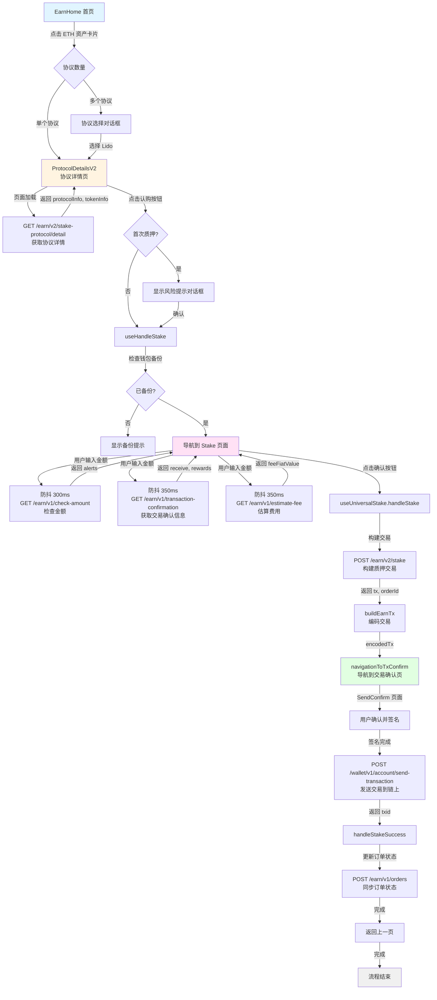
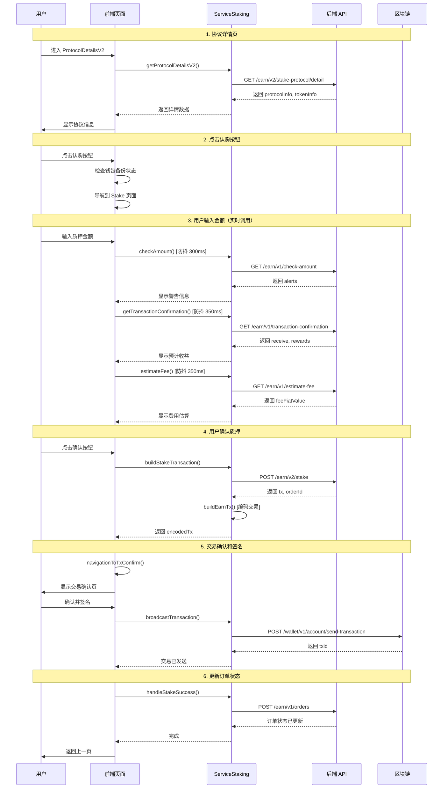
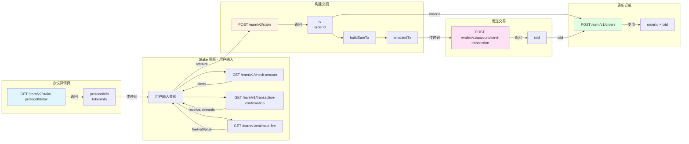

# Lido ETH Stake 完整流程分析

## 概述

本文档详细分析 Lido ETH 质押的完整流程，包括页面导航、API 调用和参数来源。

## 流程概览

### 文本流程图

```
EarnHome（首页）
  ↓ 点击 ETH 资产卡片
ProtocolDetailsV2（协议详情页）
  ↓ 点击"认购"按钮
Stake（质押页面）
  ↓ 输入金额并确认
SendConfirm（交易确认页）
  ↓ 签名并发送
完成
```

### 详细流程图（Mermaid）



### API 调用时序图（Mermaid）



### 数据流转图（Mermaid）



## 1. 页面流程

### 1.1 EarnHome（首页）

**页面路径**：`packages/kit/src/views/Earn/EarnHome.tsx`

**功能**：

- 显示推荐资产列表
- 显示可质押资产列表
- 用户点击 ETH 资产卡片

**关键代码**：

```typescript
// 点击资产卡片
toTokenProviderListPage(navigation, {
  networkId,
  accountId,
  indexedAccountId,
  symbol: 'ETH',
  protocols: [...], // 包含 Lido 协议
});
```

**导航逻辑**：

- 如果只有一个协议（Lido），直接跳转到 `ProtocolDetailsV2`
- 如果有多个协议，显示协议选择对话框

**API 调用**：

- `GET /earn/v1/recommend` - 获取推荐资产（在页面加载时）
- `GET /earn/v1/available-assets` - 获取可质押资产列表

---

### 1.2 ProtocolDetailsV2（协议详情页）

**页面路径**：`packages/kit/src/views/Staking/pages/ProtocolDetailsV2/index.tsx`

**功能**：

- 显示 Lido ETH 协议的详细信息
- 显示 APR、余额、可质押额度等
- 提供"认购"按钮

**关键代码**：

```typescript
// 获取协议详情
const detailInfo = await backgroundApiProxy.serviceStaking.getProtocolDetailsV2(
  {
    accountId,
    networkId,
    indexedAccountId,
    symbol: 'ETH',
    provider: 'lido',
    vault: undefined, // Lido ETH 不需要 vault
  },
);
```

**API 调用**：

- `GET /earn/v2/stake-protocol/detail` - 获取协议详情

**返回数据（关键字段）**：

```typescript
{
  subscriptionValue: {
    token: {
      info: { symbol: 'ETH', address: '', ... },
      price: string,
    },
    balance: string, // 用户余额
  },
  providerDetail: {
    logoURI: string,
    name: string,
    // ...
  },
  apys: {
    netApy: string, // APR
    // ...
  },
  actions: [
    {
      type: 'deposit', // 认购按钮
      // ...
    }
  ],
  // ...
}
```

**点击"认购"按钮流程**：

```typescript
const onStake = useCallback(async () => {
  // 1. 检查是否是首次质押（显示风险提示）
  const isFirstDeposit = await backgroundApiProxy.simpleDb.earnExtra.isFirstOperation(
    networkId,
    'lido',
    earnAccount.accountAddress,
    'deposit',
  );

  if (isFirstDeposit) {
    // 显示风险提示对话框
    showRiskNoticeDialogBeforeDepositOrWithdraw({...});
    return;
  }

  // 2. 调用 handleStake 导航到 Stake 页面
  await handleStake({
    protocolInfo,
    tokenInfo,
    accountId,
    networkId,
    indexedAccountId,
    setStakeLoading,
  });
}, []);
```

**导航到 Stake 页面**：

```typescript
// packages/kit/src/views/Staking/pages/ProtocolDetails/useHandleActions.ts
export const useHandleStake = () => {
  return useCallback(async ({ protocolInfo, tokenInfo, accountId, networkId, ... }) => {
    // 1. 检查钱包备份状态
    const walletId = accountUtils.getWalletIdFromAccountId({ accountId });
    if (await checkIsWalletNotBackedUp({ walletId })) {
      return; // 显示备份提示
    }

    // 2. Lido ETH 不需要授权（原生 ETH），直接导航到 Stake 页面
    appNavigation.push(EModalStakingRoutes.Stake, {
      accountId,
      networkId,
      protocolInfo, // 包含协议详情数据
      tokenInfo,    // 包含代币信息和余额
    });
  }, []);
};
```

**传递给 Stake 页面的参数**：

- `accountId`: 账户 ID
- `networkId`: 网络 ID（`evm--1`）
- `protocolInfo`: 协议信息（来自 `/earn/v2/stake-protocol/detail`）
- `tokenInfo`: 代币信息（包含余额、价格等）

---

### 1.3 Stake（质押页面）

**页面路径**：`packages/kit/src/views/Staking/pages/Stake/index.tsx`

**功能**：

- 用户输入质押金额
- 显示费用估算
- 显示交易确认信息
- 提供确认按钮

**关键组件**：`UniversalStake`

**用户输入金额时的 API 调用**：

1. **检查金额**（防抖 300ms）：

   - `GET /earn/v1/check-amount`
   - 参数来源：
     - `accountId`, `networkId`: 路由参数
     - `symbol`: `tokenInfo.token.symbol`（来自协议详情）
     - `provider`: `protocolInfo.provider`（来自协议详情）
     - `action`: `'staking'`
     - `amount`: 用户输入的金额
     - `protocolVault`: Lido ETH 不需要（`undefined`）

2. **获取交易确认信息**（防抖 350ms）：

   - `GET /earn/v1/transaction-confirmation`
   - 参数来源：
     - `networkId`: 路由参数
     - `provider`: `protocolInfo.provider`
     - `symbol`: `tokenInfo.token.symbol`
     - `vault`: Lido ETH 不需要（空字符串）
     - `accountAddress`: `protocolInfo.earnAccount.accountAddress`（来自协议详情）
     - `action`: `'staking'`
     - `amount`: 用户输入的金额

3. **估算费用**（防抖 350ms）：
   - `GET /earn/v1/estimate-fee`
   - 参数来源：
     - `networkId`: 路由参数
     - `provider`: `protocolInfo.provider`
     - `symbol`: `tokenInfo.token.symbol`
     - `action`: `'stake'`（Lido ETH 不需要授权，所以不是 `'approve'`）
     - `amount`: 用户输入的金额
     - `protocolVault`: Lido ETH 不需要（`undefined`）
     - `accountAddress`: 从 `serviceAccount.getAccount` 获取

**点击确认按钮流程**：

```typescript
const onConfirm = useCallback(async ({ amount }) => {
  await handleStake({
    amount,              // 用户输入的金额
    symbol: 'ETH',
    provider: 'lido',
    term: undefined,      // Lido ETH 不需要
    feeRate: undefined,  // Lido ETH 不需要
    protocolVault: undefined, // Lido ETH 不需要
    approveType: undefined,  // Lido ETH 不需要授权
    permitSignature: undefined, // Lido ETH 不需要
    stakingInfo: { ... },
    onSuccess: async (txs) => {
      appNavigation.pop(); // 返回上一页
      // 记录日志
      defaultLogger.staking.page.staking({...});
      onSuccess?.();
    },
  });
}, []);
```

**调用 `useUniversalStake`**：

```typescript
// packages/kit/src/views/Staking/hooks/useUniversalHooks.ts
const handleStake = useUniversalStake({ accountId, networkId });

// useUniversalStake 内部流程：
// 1. 调用 buildStakeTransaction → /earn/v2/stake
// 2. 调用 buildEarnTx（编码交易）
// 3. 调用 navigationToTxConfirm（导航到交易确认页）
```

---

### 1.4 SendConfirm（交易确认页）

**页面路径**：通过 `navigationToTxConfirm` 导航

**功能**：

- 显示交易详情
- 用户确认并签名
- 发送交易到链上

**关键流程**：

```typescript
await navigationToTxConfirm({
  encodedTx, // 编码后的交易数据
  stakingInfo, // 质押信息（包含 orderId）
  onSuccess: async (data) => {
    // 1. 保存订单信息（如果支持）
    await handleStakeSuccess({
      data,
      stakeInfo,
      networkId,
      onSuccess,
    });
    // 2. 返回上一页
    appNavigation.pop();
  },
});
```

**发送交易**：

- `POST /wallet/v1/account/send-transaction` - 发送签名后的交易到链上

**保存订单**：

- `POST /earn/v1/orders` - 更新订单状态（在交易确认后）

---

## 2. API 调用详细说明

### 2.1 获取协议详情

**接口**：`GET /earn/v2/stake-protocol/detail`

**调用位置**：`ProtocolDetailsV2` 页面加载时

**参数来源**：

- `accountId`: 路由参数或当前激活账户
- `networkId`: 路由参数（`evm--1`）
- `indexedAccountId`: 路由参数（可选）
- `symbol`: 路由参数（`ETH`）
- `provider`: 路由参数（`lido`）
- `vault`: Lido ETH 不需要（`undefined`）

**返回数据用途**：

- `subscriptionValue.token` → `tokenInfo`
- `subscriptionValue.balance` → 用户余额
- `providerDetail` → 协议信息
- `apys` → APR 显示
- `actions` → 按钮配置

---

### 2.2 检查金额

**接口**：`GET /earn/v1/check-amount`

**调用位置**：`UniversalStake` 组件，用户输入金额时（防抖 300ms）

**参数来源**：

- `networkId`: 路由参数
- `accountId`: 路由参数
- `accountAddress`: 从 `vault.getAccount()` 获取
- `symbol`: `tokenInfo.token.symbol`（来自协议详情）
- `provider`: `protocolInfo.provider`（来自协议详情）
- `action`: `'staking'`
- `amount`: 用户输入的金额
- `vault`: Lido ETH 不需要（空字符串）
- `withdrawAll`: `false`

**返回数据用途**：

- `data.alerts` → 显示警告信息
- `message` → 显示错误信息

---

### 2.3 获取交易确认信息

**接口**：`GET /earn/v1/transaction-confirmation`

**调用位置**：`UniversalStake` 组件，用户输入金额时（防抖 350ms）

**参数来源**：

- `networkId`: 路由参数
- `provider`: `protocolInfo.provider`
- `symbol`: `tokenInfo.token.symbol`
- `vault`: Lido ETH 不需要（空字符串）
- `accountAddress`: `protocolInfo.earnAccount.accountAddress`（来自协议详情）
- `action`: `'staking'`
- `amount`: 用户输入的金额

**返回数据用途**：

- `receive` → 显示预计收到的 stETH 数量
- `rewards` → 显示预计收益

---

### 2.4 估算费用

**接口**：`GET /earn/v1/estimate-fee`

**调用位置**：`UniversalStake` 组件，用户输入金额时（防抖 350ms）

**参数来源**：

- `networkId`: 路由参数
- `provider`: `protocolInfo.provider`
- `symbol`: `tokenInfo.token.symbol`
- `action`: `'stake'`（Lido ETH 不需要授权）
- `amount`: 用户输入的金额
- `protocolVault`: Lido ETH 不需要（`undefined`）
- `accountAddress`: 从 `serviceAccount.getAccount` 获取

**返回数据用途**：

- `feeFiatValue` → 显示费用（法币价值）
- `coverFeeSeconds` → 计算费用覆盖天数（如果 > 5 天显示警告）

---

### 2.5 构建质押交易

**接口**：`POST /earn/v2/stake`

**调用位置**：用户点击确认按钮后，`useUniversalStake` → `buildStakeTransaction`

**参数来源**：

- `accountAddress`: 从 `vault.getAccount()` 获取
- `networkId`: 路由参数
- `symbol`: `'ETH'`
- `provider`: `'lido'`
- `amount`: 用户输入的金额
- `firmwareDeviceType`: 从账户信息获取（硬件钱包类型）
- `bindedAccountAddress`, `bindedNetworkId`: 从推荐码服务获取（如果有）

**Lido ETH 不需要的参数**：

- `publicKey`: 不需要（仅 BTC 网络需要）
- `term`: 不需要（仅 Babylon 需要）
- `feeRate`: 不需要（仅 BTC 网络需要）
- `vault`: 不需要（仅 Morpho、Momentum 需要）
- `approveType`: 不需要（原生 ETH 不需要授权）
- `permitSignature`: 不需要

**返回数据**：

```typescript
{
  tx: {
    from: string,      // 用户地址
    to: string,        // Lido 合约地址
    value: string,     // 质押金额（wei）
    gasLimit: string,  // Gas 限制
    data: string,      // 合约调用数据
    // ...
  },
  orderId: string,     // 订单 ID（用于跟踪）
}
```

**后续处理**：

1. `buildEarnTx` - 将交易数据编码为统一格式
2. `navigationToTxConfirm` - 导航到交易确认页

---

### 2.6 发送交易

**接口**：`POST /wallet/v1/account/send-transaction`

**调用位置**：用户在交易确认页签名后

**参数来源**：

- `networkId`: 路由参数
- `accountAddress`: 账户地址
- `tx`: 签名后的交易数据（`signedTx.rawTx`）
- `signature`: 交易签名
- `rawTxType`: 交易类型

**返回数据**：

- `result`: 交易哈希（txid）

---

### 2.7 更新订单状态

**接口**：`POST /earn/v1/orders`

**调用位置**：交易确认后，`handleStakeSuccess`

**参数来源**：

- `orderId`: 来自 `/earn/v2/stake` 返回的 `orderId`
- `networkId`: 路由参数
- `txId`: 交易哈希（来自发送交易的返回）

**用途**：同步订单状态到服务器

---

## 3. 参数流转图

```
ProtocolDetailsV2
  ↓ getProtocolDetailsV2
  ↓ GET /earn/v2/stake-protocol/detail
  ↓ 返回: protocolInfo, tokenInfo
  ↓
Stake 页面
  ↓ 用户输入金额
  ↓ checkAmount → GET /earn/v1/check-amount
  ↓ getTransactionConfirmation → GET /earn/v1/transaction-confirmation
  ↓ estimateFee → GET /earn/v1/estimate-fee
  ↓ 用户点击确认
  ↓ buildStakeTransaction → POST /earn/v2/stake
  ↓ 返回: tx, orderId
  ↓ buildEarnTx（编码交易）
  ↓ navigationToTxConfirm
  ↓
SendConfirm 页面
  ↓ 用户签名
  ↓ broadcastTransaction → POST /wallet/v1/account/send-transaction
  ↓ 返回: txid
  ↓ handleStakeSuccess
  ↓ updateEarnOrderStatusToServer → POST /earn/v1/orders
  ↓ 完成
```

---

## 4. 关键参数来源总结

| 参数             | 来源                                       | 说明                      |
| ---------------- | ------------------------------------------ | ------------------------- |
| `accountId`      | 路由参数                                   | 从 ProtocolDetailsV2 传递 |
| `networkId`      | 路由参数                                   | `evm--1`                  |
| `symbol`         | 路由参数                                   | `ETH`                     |
| `provider`       | 路由参数                                   | `lido`                    |
| `protocolInfo`   | `/earn/v2/stake-protocol/detail`           | 协议详情                  |
| `tokenInfo`      | `/earn/v2/stake-protocol/detail`           | 代币信息和余额            |
| `amount`         | 用户输入                                   | Stake 页面输入            |
| `accountAddress` | `vault.getAccount()`                       | 账户地址                  |
| `orderId`        | `/earn/v2/stake` 返回                      | 订单 ID                   |
| `txId`           | `/wallet/v1/account/send-transaction` 返回 | 交易哈希                  |

---

## 5. Lido ETH 特殊说明

1. **不需要授权**：Lido ETH 是原生 ETH 质押，不需要 ERC20 授权
2. **不需要 vault**：Lido ETH 不使用 vault 参数
3. **不需要 publicKey**：仅 BTC 网络需要
4. **不需要 Permit 签名**：仅 ERC20 代币需要
5. **直接质押**：用户直接发送 ETH 到 Lido 合约

---

## 6. 代码位置索引

- **EarnHome**: `packages/kit/src/views/Earn/EarnHome.tsx`
- **ProtocolDetailsV2**: `packages/kit/src/views/Staking/pages/ProtocolDetailsV2/index.tsx`
- **Stake**: `packages/kit/src/views/Staking/pages/Stake/index.tsx`
- **UniversalStake**: `packages/kit/src/views/Staking/components/UniversalStake/index.tsx`
- **useUniversalStake**: `packages/kit/src/views/Staking/hooks/useUniversalHooks.ts`
- **useHandleStake**: `packages/kit/src/views/Staking/pages/ProtocolDetails/useHandleActions.ts`
- **ServiceStaking**: `packages/kit-bg/src/services/ServiceStaking.ts`

---
