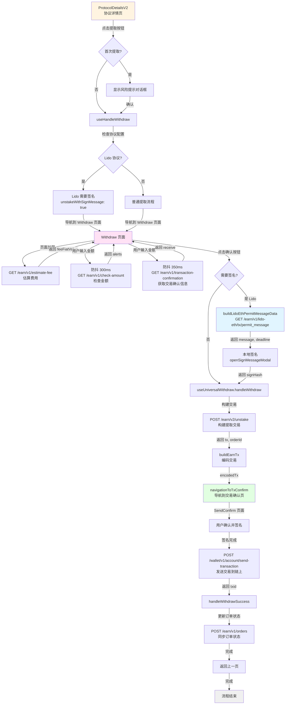
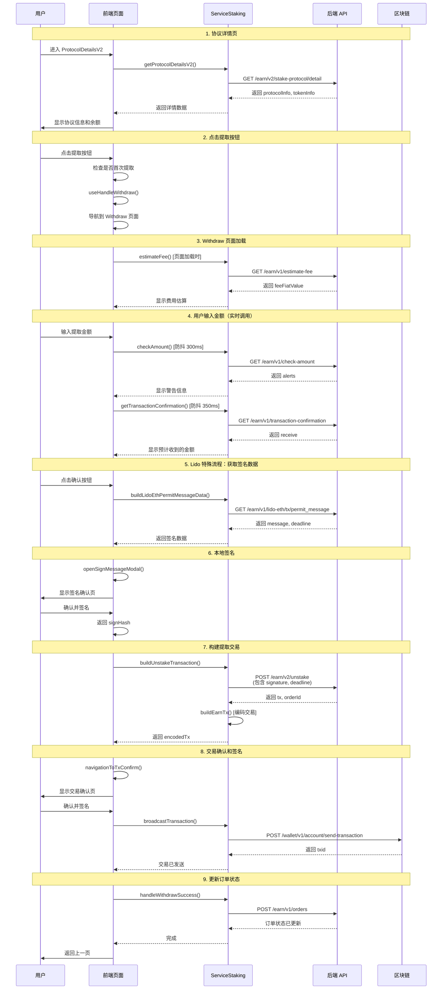
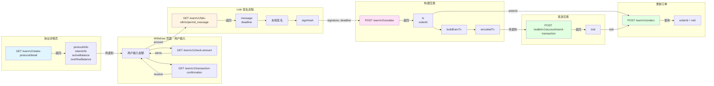

# Lido ETH Unstake 完整流程分析

## 概述

本文档详细分析 Lido ETH 提取（Unstake）的完整流程，包括页面导航、API 调用和参数来源。

## 流程概览

### 文本流程图

```
ProtocolDetailsV2（协议详情页）
  ↓ 点击"提取"按钮
Withdraw（提取页面）
  ↓ 输入金额并确认
  ↓ Lido 特殊流程：获取签名数据并签名
SendConfirm（交易确认页）
  ↓ 签名并发送
完成
```

### 详细流程图（Mermaid）



### API 调用时序图（Mermaid）



### 数据流转图（Mermaid）



---

## 1. 页面流程

### 1.1 ProtocolDetailsV2（协议详情页）

**页面路径**：`packages/kit/src/views/Staking/pages/ProtocolDetailsV2/index.tsx`

**功能**：

- 显示 Lido ETH 协议的详细信息
- 显示已质押余额（`activeBalance`、`overflowBalance`）
- 提供"提取"按钮

**关键代码**：

```typescript
// 获取协议详情
const detailInfo = await backgroundApiProxy.serviceStaking.getProtocolDetailsV2(
  {
    accountId,
    networkId,
    indexedAccountId,
    symbol: 'ETH',
    provider: 'lido',
    vault: undefined, // Lido ETH 不需要 vault
  },
);
```

**API 调用**：

- `GET /earn/v2/stake-protocol/detail` - 获取协议详情

**返回数据（关键字段）**：

```typescript
{
  subscriptionValue: {
    token: {
      info: { symbol: 'ETH', address: '', ... },
      price: string,
    },
    balance: string, // 用户余额
  },
  nums: {
    active: string,      // ⭐ 可提取余额（activeBalance）
    overflow: string,    // ⭐ 溢出余额（overflowBalance）
  },
  providerDetail: {
    logoURI: string,
    name: string,
    // ...
  },
  actions: [
    {
      type: 'withdraw', // 提取按钮
      // ...
    }
  ],
  // ...
}
```

**点击"提取"按钮流程**：

```typescript
const onWithdraw = useCallback(async (withdrawType: EStakingActionType) => {
  // 1. 检查是否是首次提取（显示风险提示）
  const isFirstWithdraw =
    await backgroundApiProxy.simpleDb.earnExtra.isFirstOperation(
      networkId,
      'lido',
      earnAccount.accountAddress,
      'withdraw',
    );

  if (isFirstWithdraw) {
    // 显示风险提示对话框
    showRiskNoticeDialogBeforeDepositOrWithdraw({
      operationType: 'withdraw',
      riskNoticeDialogContent: detailInfo?.riskNoticeDialog?.withdraw,
      onConfirm: async () => {
        await handleWithdraw({
          withdrawType,
          protocolInfo,
          tokenInfo,
          accountId,
          networkId,
          symbol,
          provider,
        });
      },
    });
    return;
  }

  // 2. 调用 handleWithdraw 导航到 Withdraw 页面
  await handleWithdraw({
    withdrawType,
    protocolInfo,
    tokenInfo,
    accountId,
    networkId,
    symbol,
    provider,
  });
}, []);
```

**导航到 Withdraw 页面**：

```typescript
// packages/kit/src/views/Staking/pages/ProtocolDetails/useHandleActions.ts
export const useHandleWithdraw = () => {
  return useCallback(async ({ protocolInfo, tokenInfo, accountId, networkId, symbol, provider, ... }) => {
    const stakingConfig = await backgroundApiProxy.serviceStaking.getStakingConfigs({
      networkId,
      symbol,
      provider,
    });

    // Lido ETH 不需要选择订单（withdrawWithTx: false），直接导航到 Withdraw 页面
    appNavigation.push(EModalStakingRoutes.Withdraw, {
      accountId,
      networkId,
      protocolInfo, // 包含协议详情数据
      tokenInfo,    // 包含代币信息和余额
    });
  }, []);
};
```

**传递给 Withdraw 页面的参数**：

- `accountId`: 账户 ID
- `networkId`: 网络 ID（`evm--1`）
- `protocolInfo`: 协议信息（来自 `/earn/v2/stake-protocol/detail`）
- `tokenInfo`: 代币信息（包含余额、价格等）

**关键数据**：

- `activeBalance`: 可提取余额（来自 `detailInfo.nums.active`）
- `overflowBalance`: 溢出余额（来自 `detailInfo.nums.overflow`）

---

### 1.2 Withdraw（提取页面）

**页面路径**：`packages/kit/src/views/Staking/pages/Withdraw/index.tsx`

**功能**：

- 用户输入提取金额
- 显示费用估算
- 显示交易确认信息
- 提供确认按钮

**关键组件**：`UniversalWithdraw`

**页面加载时的 API 调用**：

1. **估算费用**（页面加载时）：
   - `GET /earn/v1/estimate-fee`
   - 参数来源：
     - `networkId`: 路由参数
     - `provider`: `protocolInfo.provider`
     - `symbol`: `tokenInfo.token.symbol`
     - `action`: `'unstake'`
     - `amount`: `'1'`（Lido ETH 使用固定值估算）
     - `accountAddress`: 从 `serviceAccount.getAccount` 获取

**用户输入金额时的 API 调用**：

1. **检查金额**（防抖 300ms）：

   - `GET /earn/v1/check-amount`
   - 参数来源：
     - `accountId`, `networkId`: 路由参数
     - `symbol`: `tokenInfo.token.symbol`（来自协议详情）
     - `provider`: `protocolInfo.provider`（来自协议详情）
     - `action`: `'unstaking'`
     - `amount`: 用户输入的金额
     - `protocolVault`: Lido ETH 不需要（空字符串）
     - `withdrawAll`: 用户是否选择全部提取

2. **获取交易确认信息**（防抖 350ms）：
   - `GET /earn/v1/transaction-confirmation`
   - 参数来源：
     - `networkId`: 路由参数
     - `provider`: `protocolInfo.provider`
     - `symbol`: `tokenInfo.token.symbol`
     - `vault`: Lido ETH 不需要（空字符串）
     - `accountAddress`: `protocolInfo.earnAccount.accountAddress`（来自协议详情）
     - `action`: `'unstaking'`
     - `amount`: 用户输入的金额

**点击确认按钮流程（Lido 特殊流程）**：

```typescript
const onConfirm = useCallback(async ({ amount, withdrawAll }) => {
  await handleWithdraw({
    amount,              // 用户输入的金额
    symbol: 'ETH',
    provider: 'lido',
    protocolVault: undefined, // Lido ETH 不需要
    withdrawAll,
    stakingInfo: { ... },
    onSuccess: () => {
      appNavigation.pop(); // 返回上一页
      defaultLogger.staking.page.unstaking({...});
      onSuccess?.();
    },
  });
}, []);

// useUniversalWithdraw 内部流程：
// 1. 检查 stakingConfig.unstakeWithSignMessage === true
// 2. 调用 buildLidoEthPermitMessageData → GET /earn/v1/lido-eth/tx/permit_message
// 3. 本地签名（openSignMessageModal）
// 4. 调用 buildUnstakeTransaction → POST /earn/v2/unstake（传递 signature, deadline）
```

**Lido 签名流程**：

```typescript
// packages/kit/src/views/Staking/hooks/useUniversalHooks.ts
if (stakingConfig?.unstakeWithSignMessage) {
  // 1. 获取签名数据
  const { message, deadline } =
    await backgroundApiProxy.serviceStaking.buildLidoEthPermitMessageData({
      accountId,
      networkId,
      amount,
    });

  // 2. 本地签名（EIP-712 Typed Data V4）
  const signHash = await backgroundApiProxy.serviceDApp.openSignMessageModal({
    accountId,
    networkId,
    request: { origin: 'https://lido.fi/', scope: 'ethereum' },
    unsignedMessage: {
      type: EMessageTypesEth.TYPED_DATA_V4,
      message,
      payload: [account.address, message],
    },
    walletInternalSign: true,
  });

  // 3. 构建提取交易（传递签名）
  stakeTx = await backgroundApiProxy.serviceStaking.buildUnstakeTransaction({
    amount,
    networkId,
    accountId,
    symbol,
    provider,
    signature: signHash, // ⭐ Lido 签名
    deadline, // ⭐ Lido 截止时间
  });
}
```

---

### 1.3 SendConfirm（交易确认页）

**页面路径**：通过 `navigationToTxConfirm` 导航

**功能**：

- 显示交易详情
- 用户确认并签名
- 发送交易到链上

**关键流程**：

```typescript
await navigationToTxConfirm({
  encodedTx, // 编码后的交易数据
  stakingInfo, // 提取信息（包含 orderId）
  onSuccess: async (data) => {
    // 1. 保存订单信息（如果支持）
    await handleWithdrawSuccess({
      data,
      stakeInfo,
      networkId,
      onSuccess,
    });
    // 2. 返回上一页
    appNavigation.pop();
  },
});
```

**发送交易**：

- `POST /wallet/v1/account/send-transaction` - 发送签名后的交易到链上

**保存订单**：

- `POST /earn/v1/orders` - 更新订单状态（在交易确认后）

---

## 2. API 调用详细说明

### 2.1 获取协议详情

**接口**：`GET /earn/v2/stake-protocol/detail`

**调用位置**：`ProtocolDetailsV2` 页面加载时

**参数来源**：

- `accountId`: 路由参数或当前激活账户
- `networkId`: 路由参数（`evm--1`）
- `indexedAccountId`: 路由参数（可选）
- `symbol`: 路由参数（`ETH`）
- `provider`: 路由参数（`lido`）
- `vault`: Lido ETH 不需要（`undefined`）

**返回数据用途**：

- `subscriptionValue.token` → `tokenInfo`
- `subscriptionValue.balance` → 用户余额
- `nums.active` → `activeBalance`（可提取余额）
- `nums.overflow` → `overflowBalance`（溢出余额）
- `providerDetail` → 协议信息
- `actions` → 按钮配置

---

### 2.2 估算费用

**接口**：`GET /earn/v1/estimate-fee`

**调用位置**：`Withdraw` 页面加载时

**参数来源**：

- `networkId`: 路由参数
- `provider`: `protocolInfo.provider`
- `symbol`: `tokenInfo.token.symbol`
- `action`: `'unstake'`
- `amount`: `'1'`（Lido ETH 使用固定值估算，不是用户输入的金额）
- `accountAddress`: 从 `serviceAccount.getAccount` 获取

**返回数据用途**：

- `feeFiatValue` → 显示费用（法币价值）

---

### 2.3 检查金额

**接口**：`GET /earn/v1/check-amount`

**调用位置**：`UniversalWithdraw` 组件，用户输入金额时（防抖 300ms）

**参数来源**：

- `networkId`: 路由参数
- `accountId`: 路由参数
- `accountAddress`: 从 `vault.getAccount()` 获取
- `symbol`: `tokenInfo.token.symbol`（来自协议详情）
- `provider`: `protocolInfo.provider`（来自协议详情）
- `action`: `'unstaking'`
- `amount`: 用户输入的金额
- `vault`: Lido ETH 不需要（空字符串）
- `withdrawAll`: 用户是否选择全部提取

**返回数据用途**：

- `data.alerts` → 显示警告信息
- `message` → 显示错误信息

---

### 2.4 获取交易确认信息

**接口**：`GET /earn/v1/transaction-confirmation`

**调用位置**：`UniversalWithdraw` 组件，用户输入金额时（防抖 350ms）

**参数来源**：

- `networkId`: 路由参数
- `provider`: `protocolInfo.provider`
- `symbol`: `tokenInfo.token.symbol`
- `vault`: Lido ETH 不需要（空字符串）
- `accountAddress`: `protocolInfo.earnAccount.accountAddress`（来自协议详情）
- `action`: `'unstaking'`
- `amount`: 用户输入的金额

**返回数据用途**：

- `receive` → 显示预计收到的 ETH 数量

---

### 2.5 获取 Lido 签名数据（Lido 特殊接口）

**接口**：`POST /earn/v1/lido-eth/tx/permit_message`

**调用位置**：用户点击确认按钮后，`useUniversalWithdraw` → `buildLidoEthPermitMessageData`

**参数来源**：

- `accountAddress`: 从 `serviceAccount.getAccountAddressForApi` 获取
- `networkId`: 路由参数
- `amount`: 用户输入的金额

**返回数据**：

```typescript
{
  message: string; // EIP-712 格式的签名消息（JSON 字符串）
  deadline: number; // 签名截止时间（Unix 时间戳，秒）
}
```

**数据用途**：

- `message` → 用于本地签名（EIP-712 Typed Data V4）
- `deadline` → 传递给 `/earn/v2/unstake` 接口

**签名流程**：

1. 后端返回 `message`（EIP-712 格式的 JSON 字符串）
2. 前端调用 `openSignMessageModal` 进行本地签名
3. 签名类型：`EMessageTypesEth.TYPED_DATA_V4`
4. 签名 origin：`https://lido.fi/`
5. 返回签名结果：`signHash`（签名哈希）

---

### 2.6 构建提取交易

**接口**：`POST /earn/v2/unstake`

**调用位置**：用户点击确认按钮后，`useUniversalWithdraw` → `buildUnstakeTransaction`

**参数来源**：

- `accountAddress`: 从 `vault.getAccount()` 获取
- `networkId`: 路由参数
- `symbol`: `'ETH'`
- `provider`: `'lido'`
- `amount`: 用户输入的金额
- `signature`: 来自 `buildLidoEthPermitMessageData` 后的本地签名结果（`signHash`）
- `deadline`: 来自 `buildLidoEthPermitMessageData` 返回的 `deadline`
- `firmwareDeviceType`: 从账户信息获取（硬件钱包类型）
- `bindedAccountAddress`, `bindedNetworkId`: 从推荐码服务获取（如果有）

**Lido ETH 不需要的参数**：

- `publicKey`: 不需要（仅 BTC 网络需要）
- `term`: 不需要（仅 Babylon 需要）
- `feeRate`: 不需要（仅 BTC 网络需要）
- `vault`: 不需要（仅 Morpho、Momentum 需要）
- `identity`: 不需要（仅 Solana 或 Babylon 需要）
- `withdrawAll`: Lido ETH 不支持全部提取（总是 `false`）

**返回数据**：

```typescript
{
  tx: {
    from: string,      // 用户地址
    to: string,        // Lido 合约地址
    value: string,     // 提取金额（wei，通常为 0，因为提取的是 stETH）
    gasLimit: string,  // Gas 限制
    data: string,      // 合约调用数据（包含签名和截止时间）
    // ...
  },
  orderId: string,     // 订单 ID（用于跟踪）
}
```

**后续处理**：

1. `buildEarnTx` - 将交易数据编码为统一格式
2. `navigationToTxConfirm` - 导航到交易确认页

---

### 2.7 发送交易

**接口**：`POST /wallet/v1/account/send-transaction`

**调用位置**：用户在交易确认页签名后

**参数来源**：

- `networkId`: 路由参数
- `accountAddress`: 账户地址
- `tx`: 签名后的交易数据（`signedTx.rawTx`）
- `signature`: 交易签名
- `rawTxType`: 交易类型

**返回数据**：

- `result`: 交易哈希（txid）

---

### 2.8 更新订单状态

**接口**：`POST /earn/v1/orders`

**调用位置**：交易确认后，`handleWithdrawSuccess`

**参数来源**：

- `orderId`: 来自 `/earn/v2/unstake` 返回的 `orderId`
- `networkId`: 路由参数
- `txId`: 交易哈希（来自发送交易的返回）

**用途**：同步订单状态到服务器

---

## 3. 参数流转图

```
ProtocolDetailsV2
  ↓ getProtocolDetailsV2
  ↓ GET /earn/v2/stake-protocol/detail
  ↓ 返回: protocolInfo, tokenInfo, activeBalance, overflowBalance
  ↓
Withdraw 页面
  ↓ 页面加载
  ↓ estimateFee → GET /earn/v1/estimate-fee
  ↓ 用户输入金额
  ↓ checkAmount → GET /earn/v1/check-amount
  ↓ getTransactionConfirmation → GET /earn/v1/transaction-confirmation
  ↓ 用户点击确认
  ↓ buildLidoEthPermitMessageData → POST de
  ↓ 返回: message, deadline
  ↓ 本地签名（openSignMessageModal）
  ↓ 返回: signHash
  ↓ buildUnstakeTransaction → POST /earn/v2/unstake
  ↓ 传递: signature, deadline
  ↓ 返回: tx, orderId
  ↓ buildEarnTx（编码交易）
  ↓ navigationToTxConfirm
  ↓
SendConfirm 页面
  ↓ 用户签名
  ↓ broadcastTransaction → POST /wallet/v1/account/send-transaction
  ↓ 返回: txid
  ↓ handleWithdrawSuccess
  ↓ updateEarnOrderStatusToServer → POST /earn/v1/orders
  ↓ 完成
```

---

## 4. 关键参数来源总结

| 参数              | 来源                                       | 说明                        |
| ----------------- | ------------------------------------------ | --------------------------- |
| `accountId`       | 路由参数                                   | 从 ProtocolDetailsV2 传递   |
| `networkId`       | 路由参数                                   | `evm--1`                    |
| `symbol`          | 路由参数                                   | `ETH`                       |
| `provider`        | 路由参数                                   | `lido`                      |
| `protocolInfo`    | `/earn/v2/stake-protocol/detail`           | 协议详情                    |
| `tokenInfo`       | `/earn/v2/stake-protocol/detail`           | 代币信息和余额              |
| `activeBalance`   | `/earn/v2/stake-protocol/detail`           | 可提取余额（`nums.active`） |
| `overflowBalance` | `/earn/v2/stake-protocol/detail`           | 溢出余额（`nums.overflow`） |
| `amount`          | 用户输入                                   | Withdraw 页面输入           |
| `accountAddress`  | `vault.getAccount()`                       | 账户地址                    |
| `message`         | `/earn/v1/lido-eth/tx/permit_message` 返回 | EIP-712 签名消息            |
| `deadline`        | `/earn/v1/lido-eth/tx/permit_message` 返回 | 签名截止时间                |
| `signature`       | 本地签名（`openSignMessageModal`）         | 签名哈希（`signHash`）      |
| `orderId`         | `/earn/v2/unstake` 返回                    | 订单 ID                     |
| `txId`            | `/wallet/v1/account/send-transaction` 返回 | 交易哈希                    |

---

## 5. Lido ETH Unstake 特殊说明

1. **需要签名**：Lido ETH 提取需要先签名（`unstakeWithSignMessage: true`）
2. **签名流程**：
   - 调用 `/earn/v1/lido-eth/tx/permit_message` 获取签名数据
   - 本地签名（EIP-712 Typed Data V4）
   - 将签名和截止时间传递给 `/earn/v2/unstake`
3. **不需要 vault**：Lido ETH 不使用 vault 参数
4. **不需要 publicKey**：仅 BTC 网络需要
5. **不支持全部提取**：Lido ETH 不支持 `withdrawAll: true`
6. **余额来源**：从协议详情获取 `activeBalance` 和 `overflowBalance`

---

## 6. 代码位置索引

- **ProtocolDetailsV2**: `packages/kit/src/views/Staking/pages/ProtocolDetailsV2/index.tsx`
- **Withdraw**: `packages/kit/src/views/Staking/pages/Withdraw/index.tsx`
- **UniversalWithdraw**: `packages/kit/src/views/Staking/components/UniversalWithdraw/index.tsx`
- **useUniversalWithdraw**: `packages/kit/src/views/Staking/hooks/useUniversalHooks.ts`
- **useHandleWithdraw**: `packages/kit/src/views/Staking/pages/ProtocolDetails/useHandleActions.ts`
- **ServiceStaking**: `packages/kit-bg/src/services/ServiceStaking.ts`
- **buildLidoEthPermitMessageData**: `packages/kit-bg/src/services/ServiceStaking.ts` 第 197-220 行

---
